# 💰 Expense Tracker

A full-stack personal finance web application built with Spring Boot and Thymeleaf.
Track income, expenses, budgets and savings goals with a clean dashboard and real-time charts.

---

## 🖼️ Screenshots

### Dashboard
<table>
  <tr>
    <td>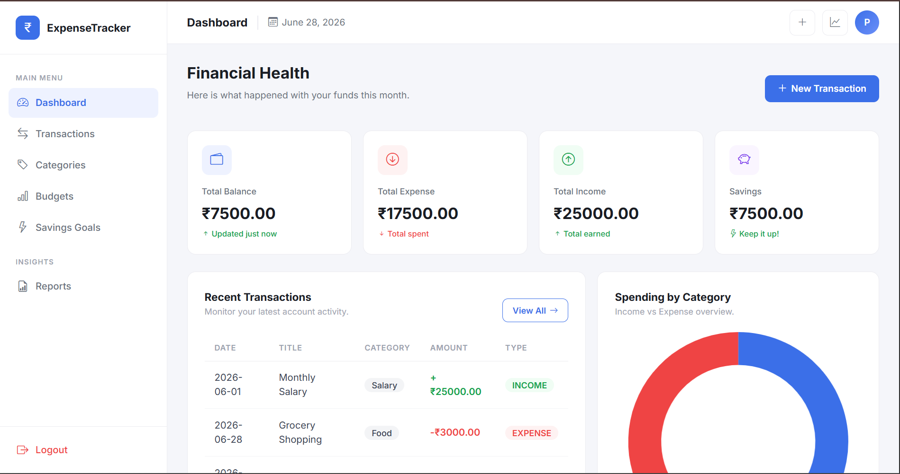</td>
    <td>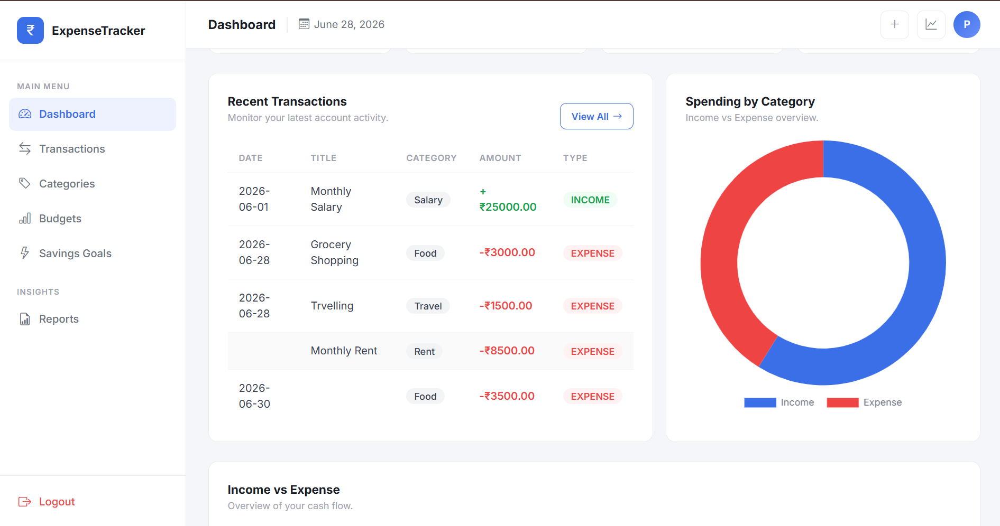</td>
  </tr>
</table>

### Transactions
<table>
  <tr>
    <td>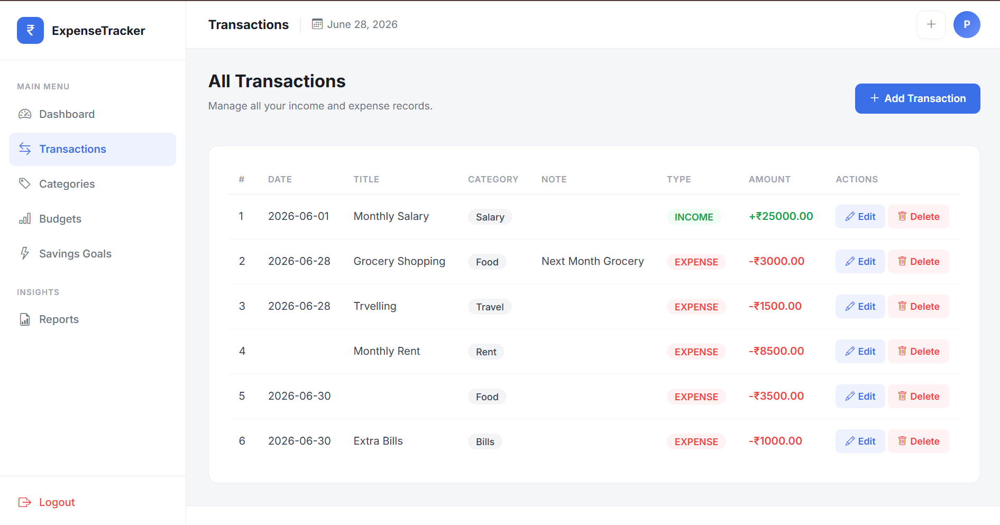</td>
    <td>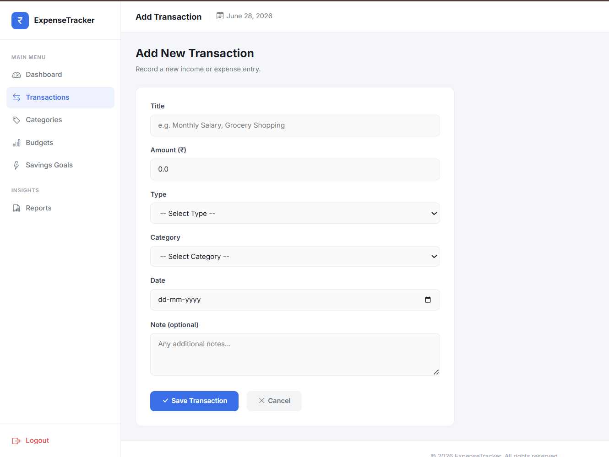</td>
  </tr>
</table>

### Categories
<table>
  <tr>
    <td>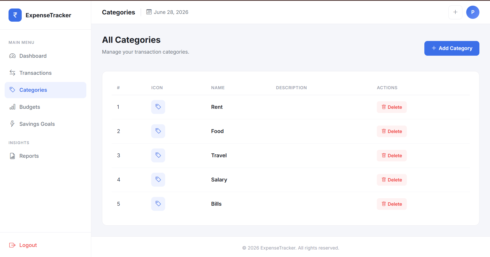</td>
    <td>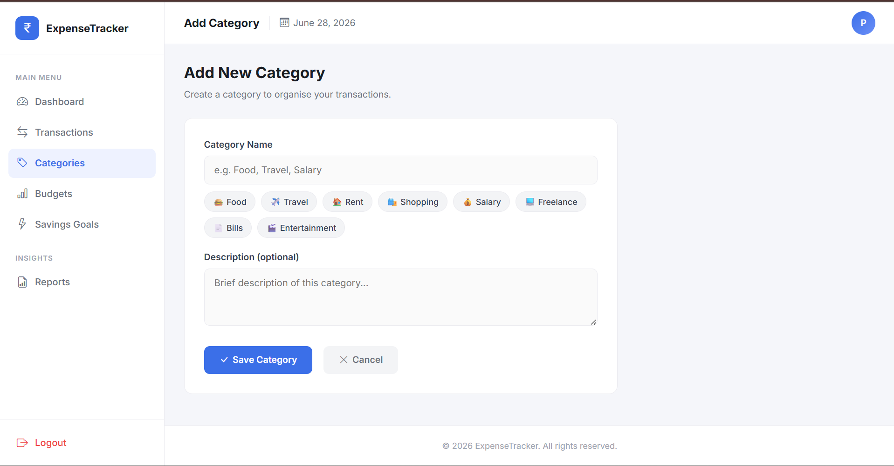</td>
  </tr>
</table>

### Budgets
<table>
  <tr>
    <td>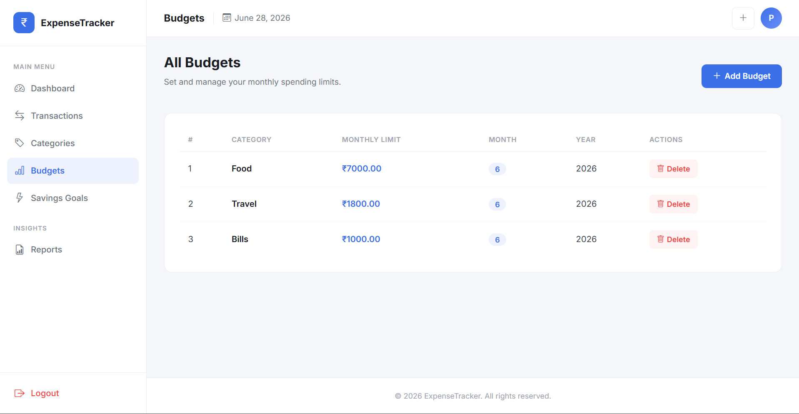</td>
    <td>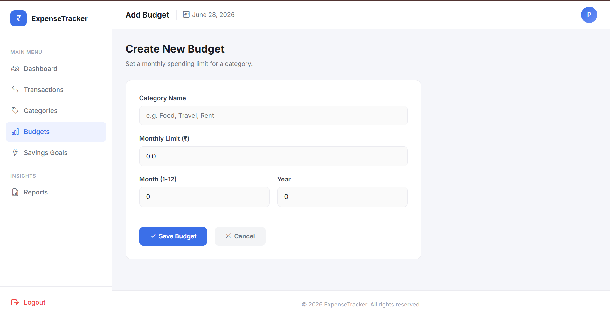</td>
  </tr>
</table>

### Savings Goals
<table>
  <tr>
    <td>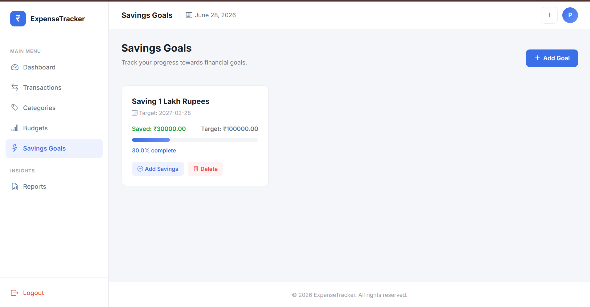</td>
    <td>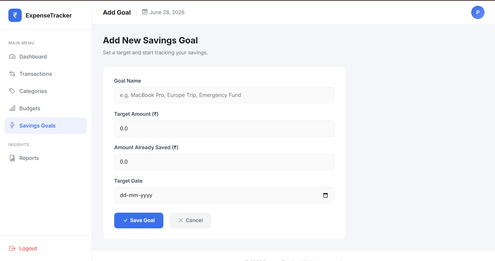</td>
  </tr>
</table>

### Reports
<table>
  <tr>
    <td>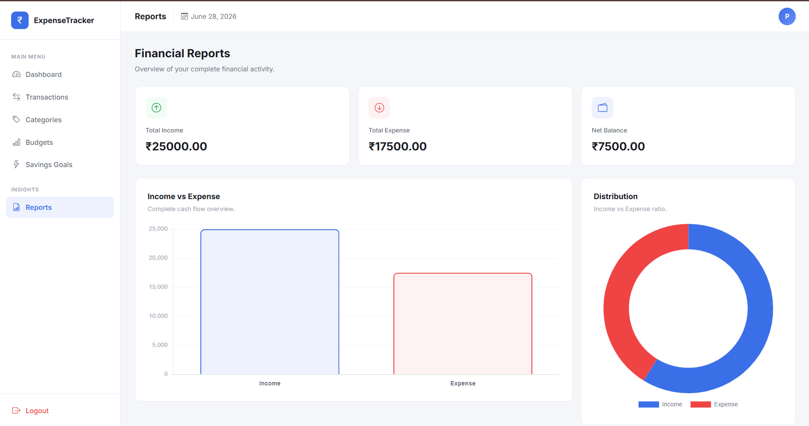</td>
    <td>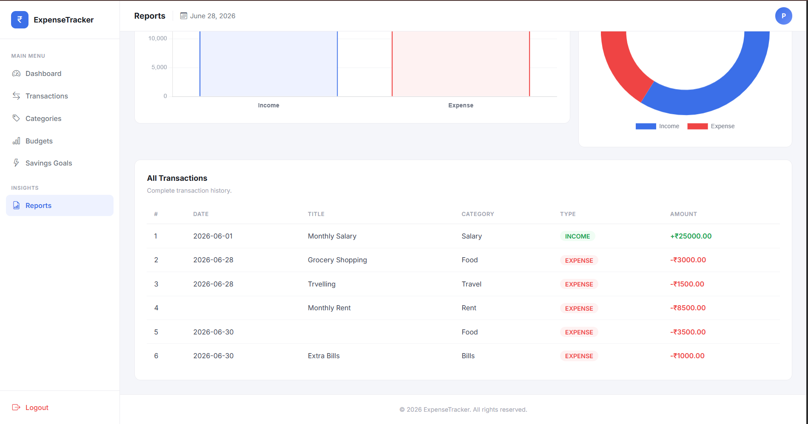</td>
  </tr>
</table>

---

## About

Expense Tracker Pro is a personal finance management application where users can record
their daily transactions, set monthly budgets for different spending categories, create
savings goals and track progress, and get a complete financial overview through the
dashboard and reports pages.

All data is stored in a MySQL database. The application is built on Spring Boot using
the MVC pattern with a Service and Repository layer. The UI is rendered server-side
using Thymeleaf templates styled with Bootstrap 5.

---

## Features

**Dashboard** — Summary cards for Balance, Income, Expense and Savings. Recent
transactions table. Income vs Expense bar chart and spending distribution doughnut
chart, both powered by Chart.js.

**Transactions** — Add, edit and delete income or expense transactions. Each
transaction has a title, amount, type, category, date and optional note.

**Categories** — Create and delete custom categories like Food, Travel, Rent, Salary.
Quick suggestion chips for one-click selection. Categories appear in the transaction
form dropdown.

**Budgets** — Set monthly spending limits per category. Specify the month and year
for each budget.

**Savings Goals** — Create goals with a target amount and target date. Add savings
incrementally and track progress with a visual progress bar and percentage display.

**Reports** — Full financial overview with charts and complete transaction history.

---

## Tech Stack

| | |
|---|---|
| Backend | Spring Boot 3.5, Java 17 |
| Web Layer | Spring MVC |
| Database | MySQL 8.0 |
| ORM | Spring Data JPA, Hibernate |
| Templates | Thymeleaf |
| Styling | Bootstrap 5, Bootstrap Icons |
| Charts | Chart.js |
| Build | Maven |

---

## Project Structure
src/main/java/com/yourname/expensetracker/

│

├── entity/

│      ├── Transaction.java

│      ├── Category.java

│      ├── Budget.java

│      └── SavingsGoal.java

│

├── repository/

│      ├── TransactionRepository.java

│      ├── CategoryRepository.java

│      ├── BudgetRepository.java

│      └── SavingsGoalRepository.java

│

├── service/

│      ├── TransactionService.java

│      ├── CategoryService.java

│      ├── BudgetService.java

│      └── SavingsGoalService.java

│

└── controller/

├── DashboardController.java

├── TransactionController.java

├── CategoryController.java

├── BudgetController.java

├── SavingsGoalController.java

└── ReportsController.java
src/main/resources/

│

├── templates/

│      ├── dashboard.html

│      ├── transactions/

│      │      ├── list.html

│      │      ├── add.html

│      │      └── edit.html

│      ├── categories/

│      │      ├── list.html

│      │      └── add.html

│      ├── budgets/

│      │      ├── list.html

│      │      └── add.html

│      ├── goals/

│      │      ├── list.html

│      │      ├── add.html

│      │      └── update.html

│      └── reports/

│             └── index.html

│

└── application.properties

---

## Database

Four tables are auto-created by Hibernate on first run.

**categories** — id, name, description

**transactions** — id, title, amount, type (INCOME / EXPENSE), transaction_date,
note, category_id (FK → categories)

**budgets** — id, category_name, monthly_limit, month, year

**savings_goals** — id, goal_name, target_amount, current_amount, target_date

---

## Running Locally

**1. Create the database**
```sql
CREATE DATABASE expense_tracker;
```

**2. Update application.properties**
```properties
spring.datasource.url=jdbc:mysql://localhost:3306/expense_tracker
spring.datasource.username=root
spring.datasource.password=yourpassword
spring.jpa.hibernate.ddl-auto=update
spring.jpa.show-sql=true
server.port=8484
```

**3. Run**
```bash
mvn spring-boot:run
```

**4. Open browser**
http://localhost:8484/dashboard

No manual SQL scripts needed. Tables are created automatically on first run.

---

## Spring Boot Concepts Covered

- `@Controller`, `@RequestMapping`, `@GetMapping`, `@PostMapping`
- `@Entity`, `@ManyToOne`, `@JoinColumn`, `@GeneratedValue`
- `JpaRepository` with built-in CRUD methods
- `@Autowired`, `@Service`, `@Repository`
- Thymeleaf — `th:each`, `th:text`, `th:href`, `th:field`, `th:if`, `th:object`
- MVC Architecture — Controller → Service → Repository → Entity
- MySQL integration with Spring Data JPA and Hibernate

---

## Note

Single-user application with no authentication.
Spring Security login can be added as a future enhancement.

---

**Pratik** — Java Developer